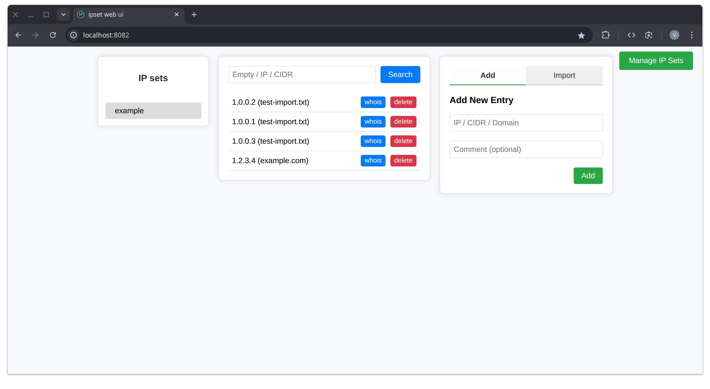

# ipset-ui

**ipset-ui** is a web interface for managing IP sets via the ipset CLI on a server. The project consists of a Go backend service and a Vue 3 frontend application.

>ipset-ui builds into a single binary file with an embedded frontend. To run the application, you only need this one file.



## Features

- View, create, and delete ipset sets
- Add, remove, and search IP addresses and CIDRs in sets
- Import a list of CIDR or IP addresses from a file (for example, exported from [ip2location Visitor Blocker](https://www.ip2location.com/free/visitor-blocker))
- Import IP addresses by domain name
- Whois queries for IP addresses directly from the interface
- Backup and restore ipset sets via the web interface
- Convenient notifications and action confirmations

## Import from File

You can import a list of CIDR or IP addresses from a file (for example, exported from [ip2location Visitor Blocker](https://www.ip2location.com/free/visitor-blocker) in CIDR output format). The web interface allows you to upload and bulk add entries to an ipset set.

## Quick Start

### Local

```
make build
sudo ./ipset-ui
```

### Docker

```
make docker-compose-up
```

## Environment Variables

- `APP_DIR` —  Path to the application directory. (default /opt/ipset-ui) (optional)
- `LISTEN_ADDRESS` — Address and port for the backend service (which also serves the web interface) to listen on. (default 0.0.0.0:8080) (optional)
